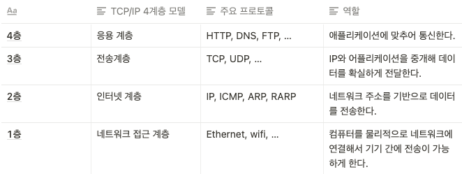
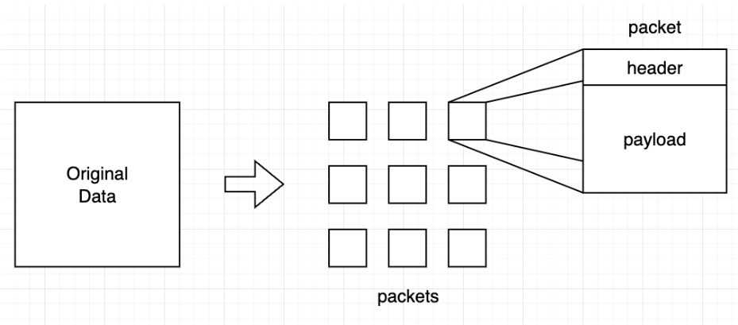
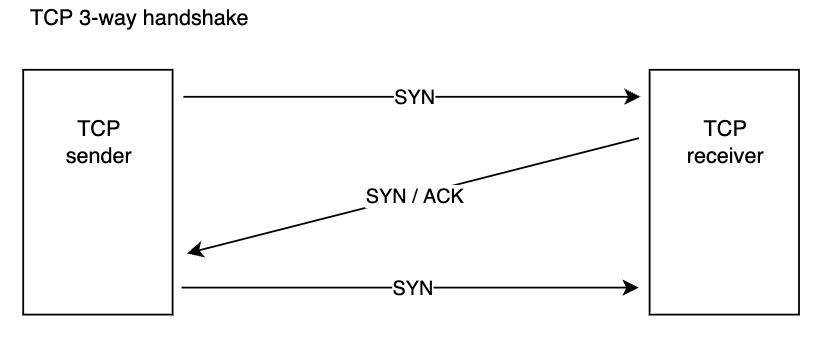

# TCP/IP

현재까지 표준으로 사용하고 있는 TCP와 IP에서 가져온 통신규약(Protocol) 모음 4계층(응용, 전송, 인터넷, 네트워크 접근)으로 나뉨

## 주소

### IP 주소

컴퓨터를 식별하기 위해 사용되는 주소. 4개의 8비트 필드로 구성됨  
ex) 192.72.255.255

#### 서브넷 마스크

IP 주소는 어떤 네트워크인지 알 수 있는 네트워크부와 그 네트워크 안의 특정 컴퓨터를 지칭하는 정보인 호스트부로 나뉜다. IPv4 주소에서 네트워크 부가 어디까지인지 나타내는 것이 서브넷 마스크이다.  
ex) 서버넷 마스크 : 255.255.255.0 일 때, 앞 3개의 필드가 네트워크부, 나머지 1개 필드를 호스트부로 사용한다. 

### MAC 주소

TCP/IP와 달리 이더넷(LAN, MAN)에서 사용하는 주소

### 패킷

일대일로 데이터를 전부 교환하는 회선교환 방식이 다수의 기기와 통신해야하는 컴퓨터 네트워크 특성상 효율적이지 않기 때문에 패킷교환방식을 사용한다. 원본 데이터를 패킷이라는 작은 단위로 나누고, 여러 회선을 공용해 통신을 주고 받는다. 

## TCP,UCP

TCP/IP의 전송계층에 해당하는 대표적인 프로토콜  
신뢰성과 순서를 보장하기 위해서는 TCP, 빠른 속도를 위해서는 UDP를 사용한다. 

### TCP

신뢰성 있는 전송을 위한 방법으로 3-way handshake를 사용한다.

1. sender가 receiver에게 통신을 시작하고 싶다고 보낸다.
2. receiver는 sender에게 요청을 받았다고 ACK을 보낸다.
3. sender가 다시 전송하면서 실제 데이터 전송이 시작하게 된다. 

## PORT
대상 IP 기기의 특정 어플리케이션을 특정하는 번호.  
한 서버 인트턴스에서 웹 서버와 메일 서버 두 개를 동시 실행중이라면 포트 번호로 보내는 요청인지 특정할 수 있게 됨.

## URL
웹에 게시된 어떤 자원을 찾기 위한 브라우저에 사용되는 메카니즘. HTML이나 이미지 등 리소스의 위치를 틍정하기 위한 서식으로써 탄생  
ex) file://127.0.0.1/home/username/Desktop  
URL의 기본요소와 query, bookmark를 포함한 것이 URI이다.

## DNS
숫자로만 표시된 주소를 기억하기 쉬운 문자(Domain name)으로 변환하는 SYSTEM