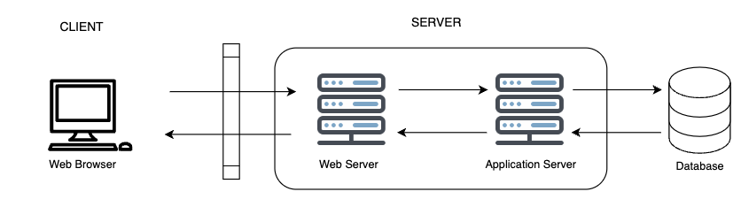

# 웹

## 웹 어플리케이션 아키텍쳐

웹 어플리케이션은 사용자인 클라이언트와 데이터를 처리하는 서버영역으로 나뉠 수 있고, 서버는 데이터 저장소인 데이터베이스로 나뉠 수 있다.  
웹 어플리케이션은 막대한 트래픽에 노출 될 수 잇기 때문에 이와 같은 요소들을 고려해야함
- 신뢰성(reilability)
- 확장성(scalability)
- 보안성(security)
- 견고성(robustness)

## 웹 어플리케이션의 요청흐름
- 브라우저에 URL을 입력하고 DNS 서버에 서버 주소를 찾기 위해 요청 보냄.
- IP 주소를 찾으면 해당 주소에 HTTPS 요청을 보냄.
- 웹 서버에 요청이 도착하고 페이지 관련 데이터들을 가져옴.
- 비즈니스 로직이 자용하면서 각 데이터들을 어떻게 다룰지 정함
- 요청받은 데이터들이 처리되고 브라우저에 응답한 후, 화면에서 출력됨.

## 웹 애플리케이션 구현 기술
### HTTP

웹 브라우저 상에서 클라이언트와 서버간의 통신을 담당하는 프로토콜

### Cookie와 Session

- Cookie : 유저의 정보를 클라이언트에 보관하고, 다음 접속부터 해당 정보를 서버로 보내 서버가 식별하게 함.
- Sessoin : 고유 아이디를 할당해서 유저를 식별함.

## SSR과 CSR

### SSR
Server Side Rendering의 줄임말. 서버 측에서 Javascript가 페이지를 렌더링  
배송 출발지에서 조립을 완료한 상태로 보내는 것.  
ex) 네이버 블로그, 뉴욕 타임즈

### CSR
Client Side Rendering의 줄임말. 클라이언트 측에서 Javascript가 페이지를 렌더링  
제품을 나눠서 운송하여 배송지에서 조립하는 경우  
ex) 예약 사이트들(아고다)

  
단일 파일의 용량이 작고 웹 페이지가 사용자와 상호작용이 적은 경우 SSR, 상호작용이 풍부하고 더 나은 UX를 제공하기 위해서는 CSR이 적합

## AJAX
Asynchronous Javascript And XMLHttpRequest의 약자. 웹 페이지의 필요한 부분에 필요한 데이터만 비동기적으로 받아와 화면에 그려낼 수 있음

### AJAX의 장점
- 서버에서 HTML을 완성하여 보내지 않아도 웹페이지를 만들 수 있음.
- 브라우저에 상관없이 사용가능
- 필요한 부분만 렌더링하기 때문에 빠르고 더 많은 상호작용이 가능한 어플리케이션 제작 가능
### AJAX의 단점
- 뼈대만 있는 HTML 파일에 데이터가 없기 때문에 사이트의 정보를 긁어가기 어려움
- 이전 상태를 기억하지 않기 때문에 사용자가 의도한 대로 동작하지 않음. 뒤로가기 기능 구현을 위해 별도 History API를 사용해야함.